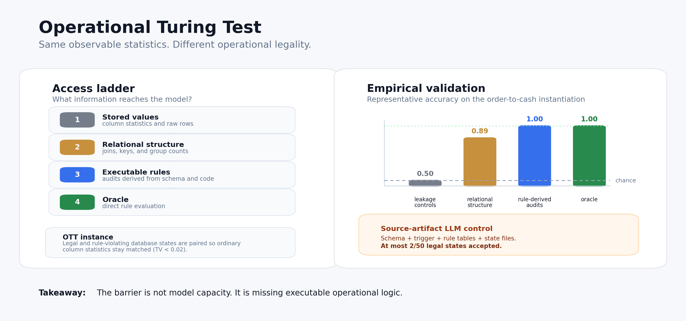

# Statistically Indistinguishable, Operationally Distinct: A Formal Barrier for Tabular Foundation Models

[](.)
[](LICENSE)
[](https://www.python.org)
[](REPRODUCE.md)
[](https://api.reuse.software/info/github.com/SAP-samples/operational-turing-test)

#### News

- **07/2026:** Accepted at the 2nd ICML Workshop on Foundation Models for Structured Data.
- **07/2026:** Released matched 100-state LLM source-artifact controls for GPT-5.5, GPT-5.5 + SQL executor, and Kimi-K2.6.
- **07/2026:** Added banking-ledger replication with structurally distinct rule families.

## Description

This repository contains the code, generated data, precomputed results, and
figures for the Operational Turing Test (OTT). OTT is a benchmark construction
for testing whether tabular models can distinguish legal database states from
single-rule violations when ordinary value statistics are intentionally matched.

Tables in production systems are not just values. They are the visible trace of
application code, database constraints, triggers, and business rules. Strip that
operational layer away and the data reaching a model becomes a projection:
stored values remain, but much of the logic that makes a state legal is gone.

## Abstract

The Operational Turing Test pairs legal and rule-violating database states so
ordinary 1- and 2-way column-value statistics stay matched (`TV < 0.02`). Le
Cam's lemma then bounds any values-only classifier at chance. The result is not
a capacity failure: larger models and richer value representations cannot
recover logic they cannot evaluate. In our order-to-cash instantiation,
XGBoost, TabICL, TabPFN, and raw row-level access remain at chance; relational
structure recovers connectivity-visible rule families but misses
value-transformation logic; and seven executable rule-derived audits close the
gap. Frontier reasoning models given schema, trigger source, rule tables, and
state files still accept at most `2/50` legal states.

## Information

<p align="center">

</p>

### Main result

The paper evaluates an access ladder rather than a leaderboard:

| Access level | What the model sees | Representative result |
| :-- | :-- | :-- |
| Leakage controls | column statistics, values-only baselines, raw rows | `0.50` accuracy |
| Relational structure | joins, key coverage, group counts, relational PFN baseline | `0.89` accuracy, but value-transformation recall remains `0.00-0.02` |
| Executable rule-derived audits | seven SQL audits derived from schema, trigger, and application rules | `1.00` classification accuracy |
| Oracle | direct rule evaluation | `1.00` classification accuracy |

The values-only controls use XGBoost, TabICL, and TabPFN and are statistically
equivalent to chance under a pre-registered TOST equivalence test (`p < 0.002`,
margin `±2 pp`). Relational structure recovers connectivity-visible rule
families such as foreign-key, cardinality, and state-transition violations. It
does not recover value-transformation logic: stored totals must be recomputed
from quantities, prices, discounts, and taxes.

The same access-ladder pattern appears on a second banking-ledger schema with
structurally distinct rule families: balance and cumulative-account rules are
not solved by value statistics alone.

### Frontier-LLM source-artifact control

The LLM controls receive the schema, trigger source, procedural rule tables,
and state CSVs. The task is still binary legality classification.

| Run | Accuracy | LEGAL on legal states | Illegal states labelled illegal |
| :-- | :--: | :--: | :--: |
| GPT-5.5 default prompt | 0.50 | 0/50 | 50/50 |
| GPT-5.5 high effort | 0.50 | 0/50 | 50/50 |
| GPT-5.5 + SQL executor | 0.50 | 0/50 | 50/50 |
| Kimi-K2.6 | 0.46 | 2/50 | 44/50 |

The key diagnostic is not overall accuracy: several runs reject almost every
state as illegal. The striking failure is valid-state recall. GPT-5.5 accepts
no legal state even when given higher reasoning effort or a SQL execution tool;
Kimi-K2.6 accepts two legal states and hits the output cap on `14/100` states.
The SQL-executor run can execute queries, but the audit logic is still specified
ad hoc by the model rather than compiled from the operational rules.

## Usage

### Installation

```bash
git clone https://github.com/SAP-samples/operational-turing-test.git
cd operational-turing-test
python -m venv .venv && source .venv/bin/activate
pip install -e ".[dev,tabpfn]"
```

### Run the headline experiment

```bash
python scripts/run_turing_test.py
```

Single CPU, no GPU. Full non-LLM reproduction takes about **45 minutes** on a
2023 laptop. The LLM controls are API-dependent and use credentials from a local
`.env` file; no keys are stored in the repository. See [`REPRODUCE.md`](REPRODUCE.md)
for the per-claim mapping.

### Regenerate the LLM export

```bash
python scripts/export_relational_dataset.py \
    --n-train 0 --n-test 100 --n-customers 50 \
    --out-dir artifacts/relational_export_n50 --overwrite
```

The scripts in [`experiments/`](experiments/) consume that export for the
GPT-5.5 and Kimi-K2.6 source-artifact controls. See
[`experiments/README.md`](experiments/README.md) for the exact commands.

## The Benchmark

A test instance is a pair of database states `(S_legal, S_illegal)` over a small
order-to-cash schema (`customers`, `orders`, `order_items`). The illegal state is
generated by applying exactly one of four single-rule corruption strategies.
Each is constructed so all 1- and 2-way column-value marginals between the two
states stay within total variation distance `τ = 0.02`.

| Corruption | Rule violated | Where the rule lives | Empirical max TV |
| :-- | :-- | :-- | :--: |
| `fk_break` | referential integrity | schema (FK declaration) | `0.0000` |
| `cardinality_break` | per-customer / per-order limits | mixed (CHECK + application) | `0.0069` |
| `derivation_break` | line- and order-total value transformations | application code | `0.0033` |
| `transition_break` | legal value-state transitions | trigger code | `0.0038` |

The model is evaluated under one of four access tiers. The order-to-cash
features live in [`src/tf_pilot/features.py`](src/tf_pilot/features.py), and the
banking-ledger relational features live in
[`src/bank_pilot/relational_features.py`](src/bank_pilot/relational_features.py):

- **values-only**: column-level summaries used as leakage controls.
- **row-level**: raw `orders` rows fed per-row, then aggregated by majority vote per state.
- **relational**: values plus joins, key coverage, group degrees, and within-row value pairs such as `(prev_status, status)`.
- **operationally grounded**: values plus seven executable rule-derived audits, each a SQL check derived from the schema and rule code.

## Repository Structure

```text
OTT/
├── README.md            project description
├── REPRODUCE.md         per-claim mapping: paper element -> script -> result file
├── LICENSE              Apache-2.0
├── pyproject.toml       Python package metadata + dependencies
├── requirements.txt     pip-style dependency list
├── .env.example         template for endpoint / key env vars
├── schema/              order-to-cash DDL and trigger source
├── src/tf_pilot/        order-to-cash generator, corruptions, features, baselines
├── src/bank_pilot/      banking-ledger replication generator and features
├── scripts/             runnable experiments, one per paper claim
├── tests/               pytest smoke tests for the construction
├── results/             precomputed CSVs for paper tables and LLM pilots
├── figures/             README hero and diagnostic figures
└── experiments/         frontier-LLM pilot scripts
```

## Pre-Registration

The marginal-match threshold `τ = 0.02` is fixed in
[`src/tf_pilot/verifier.py`](src/tf_pilot/verifier.py). The TOST equivalence
margin `δ = 0.02`, random seeds, and per-baseline scales are fixed in the
corresponding runnable scripts, especially
[`scripts/run_turing_test.py`](scripts/run_turing_test.py),
[`scripts/validate_construction.py`](scripts/validate_construction.py), and the
follow-up scripts listed in [`REPRODUCE.md`](REPRODUCE.md).

## Requirements

- Python 3.10+
- CPU execution for the non-LLM reproduction
- Optional API credentials for the GPT-5.5 and Kimi-K2.6 controls
- Optional RDB-PFN dependency for the relational PFN baseline; see
  [`external/RDBPFN/README.md`](external/RDBPFN/README.md)

## Known Issues

- The LLM source-artifact controls depend on hosted model deployments and may
  vary with provider-side model snapshots.
- The RDB-PFN baseline requires a third-party implementation that is not vendored
  in this repository.

## Authors

- [Tassilo Klein](https://tjklein.github.io/), SAP SE
- [Johannes Hoffart](https://www.hoffart.ai/), SAP SE

## Citation

If you use this benchmark or code, please cite:

```bibtex
@inproceedings{klein2026ott,
  title     = {Statistically Indistinguishable, Operationally Distinct: A Formal Barrier for Tabular Foundation Models},
  author    = {Klein, Tassilo and Hoffart, Johannes},
  booktitle = {Proceedings of the 2nd ICML Workshop on Foundation Models for Structured Data},
  address   = {Seoul, South Korea},
  year      = {2026}
}
```

## Roadmap

- [x] Release order-to-cash OTT construction and access-ladder results.
- [x] Release matched 100-state source-artifact LLM controls.
- [x] Release banking-ledger replication.
- [x] Add public citation metadata.

## How to Obtain Support

Create an issue in this repository if you find a bug, a broken path, or a
reproducibility problem.

## Contributing

Fixes and improvements are welcome via pull request. Please avoid committing
local `.env` files, API keys, generated caches, or provider-specific secrets.

## License

Copyright 2026 SAP SE or an SAP affiliate company and contributors. Please see our LICENSE for copyright and license information. Detailed information including third-party components and their licensing/copyright information is available via the REUSE tool.
